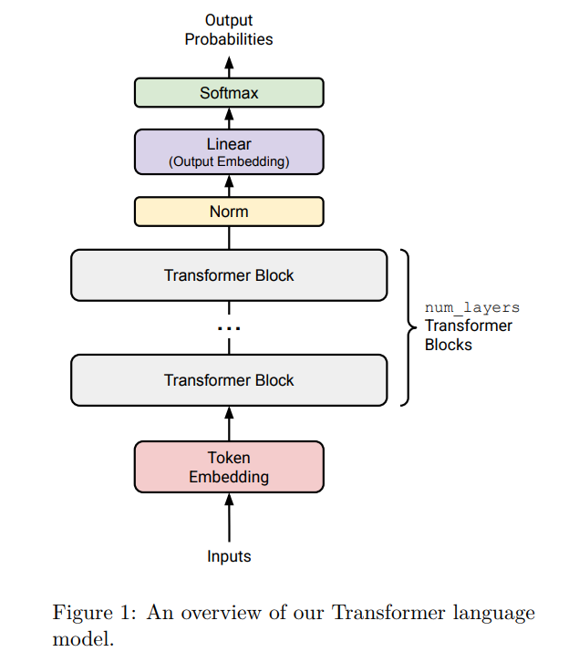
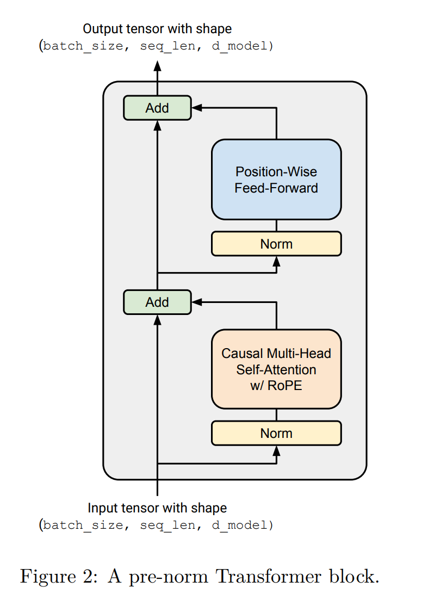

本章带你编写Transformer，并且最后带你简单算一遍内存和FLOPs，但不包括训练和生成（在4-6章）。

本文少量mathcal相关的markdown无法被github原生渲染器渲染，你可以选择跳过它们或把此.md文件尝试在其他软件中打开，或直接移步。

本课程对transformer相关的算法本身既不全面也不清楚。如果读者对相关算法并不熟悉，笔者推荐去选择性地完成cs231n中神经网络和transformer相关的作业；内含充足的scaffolding和数学原理内容（主要包括反向传播的推导），能够在带你速通相关算法的同时，让你对这些神经网络的整个过程有更良好的认识。  

如果你熟悉相关算法，chapter3和接下来的章节要比chapter2简单得多。你大可以vibecode softmax之类你非常熟悉的任务，在数个小时内完成ch.3。  

# 3  Transformer 

一个语言模型（LM）接受一批整数token ID序列作为输入（即，形状为`(batch_size, sequence_length)` 的 `torch.Tensor`），并返回词表上的（批量）归一化概率分布（即形状为 `(batch_size, sequence_length, vocab_size)` 的 PyTorch 张量），其中预测的分布是针对每个输入 token 的下一个词的（即，对词典里的每一个词得到一个score）。  
在训练语言模型（training）时，我们使用这些下文预测来计算实际下一个词与预测下一个词之间的交叉熵损失。  （然后通过反向传播减小这些损失）
在推理过程中利用语言模型生成文本（validation/testing）时，我们取最后一个时间步（即序列中的最后一项）预测的下文概率分布来生成序列中的下一个 token（例如，通过选取概率最高的 token、从分布中采样等），将这个 token 添加到输入序列中，并重复此过程。
这一部分的作业中，你将从零开始构建这个模型。我们将先从模型的高层描述开始，然后逐步介绍各个组件。
<br> <br> <br>
## 3.1 Transformer 语言模型（LM）

给定一个 token ID 序列，Transformer 语言模型使用输入嵌入（input embedding，通过它将离散的整数ID映射到高维连续空间，转换成稠密向量），将嵌入后的 token 通过 `num_layers` 个 Transformer 块，然后应用一个学习到的线性投影（“输出嵌入”或“LM head”）来产生预测的下一 token 的未归一化的得分（logits）。
示意图请参见图 1。  
### Figure 1


### 3.1.1 Token 嵌入

第一步，Transformer 将（批量的）token ID 序列嵌入为包含 token 身份信息的向量序列（图 1 中的红色块）。

具体来说，给定一个 token ID 序列，Transformer 语言模型使用一个 token 嵌入层来生成一个向量序列。每个嵌入层接收一个形状为 `(batch_size, sequence_length)` 的整数张量，并产生一个形状为 `(batch_size, sequence_length, d_model)` 的向量序列。(也即，把每个数字索引变成一个长度为`d_model`的向量。)

### 3.1.2 Pre-norm Transformer 块

嵌入之后，激活值由几个结构相同的神经网络处理。一个标准的纯解码器（decoder-only）Transformer 语言模型由 `num_layers` 个相同的层（通常称为 Transformer “块（blocks）”）组成。每个 Transformer 块接收形状为 `(batch_size, sequence_length, d_model)` 的输入，并返回形状为 `(batch_size, sequence_length, d_model)` 的输出。每个块通过自注意力机制（self-attention）聚合整个序列的信息，并通过前馈层（feed-forward layers）对其进行非线性转换。
<br> <br> <br>
## 3.2 输出归一化与嵌入

在经过 `num_layers` 个 Transformer 块之后，我们将取最终的激活值并将其转化成词表上的分布。

我们将实现“Pre-norm” Transformer 块（详见 §3.5），这额外要求在最后一个 Transformer 块之后使用层归一化（Layer Normalization，详见下文），以确保其输出被正确缩放。

在此归一化之后，我们将使用一个标准的学习线性变换，将 Transformer 块的输出转换为预测的下一 token 的 logits（例如，参见 Radford 等人 [2018] 的公式 2）。
<br> <br> <br>
## 3.3 注：批处理、Einsum 与高效计算

在整个 Transformer 中，我们将对许多类似批次的输入执行相同的计算。比如：

1 批次元素：我们对每个批次元素应用相同的 Transformer 前向操作。
2 序列长度：像 RMSNorm 和前馈层这样的“位置级（position-wise）”操作对序列的每个位置执行完全相同的操作。
3 注意力头：在“多头”注意力操作中，注意力操作跨注意力头进行批处理。


拥有一个符合人体工程学的方式来执行这些操作是很有用的，这样既能充分利用 GPU，又易于阅读和理解。许多 PyTorch 操作可以在张量开头接收多余的“类批次（batch-like）”维度，并高效地跨这些维度重复/广播操作。

例如，假设我们正在做一个位置级的批量操作。我们有一个形状为 `(batch_size, sequence_length, d_model)` 的“数据张量” $D$，我们想对一个形状为 `(d_model, d_model)` 的矩阵 $A$ 进行批量向量-矩阵乘法。在这种情况下，`D @ A` 将执行批量矩阵乘法，这是 PyTorch 中一个高效的原语（primitive），其中 `(batch_size, sequence_length)` 维度被批量处理。

因此，假设你的函数可能会被赋予额外的类批次维度，并将这些维度保持在 PyTorch 形状的开头是有帮助的。为了以这种方式组织张量以便进行批处理，可能需要使用 `view`、`reshape` 和 `transpose` 的多个步骤来调整它们。这可能有点痛苦，而且通常很难读懂代码在做什么以及张量的形状是什么。

一个更符合人体工程学的选择是在 `torch.einsum` 中使用 einsum 符号，或者使用像 `einops` 或 `einx` 这样与框架无关的库。两个核心操作是 `einsum`（可以对输入张量的任意维度进行张量收缩）和 `rearrange`（可以对任意维度进行重排、连接和拆分）。事实证明，机器学习中几乎所有的操作都是维度操作和张量收缩的某种组合，偶尔带有（通常是逐元素的）非线性函数。这意味着使用 einsum 符号可以使你的很多代码更具可读性和灵活性。

我们强烈建议在课程中学习并使用 einsum 符号。以前没有接触过 einsum 符号的学生应该使用 `einops`（文档见[此处](https://einops.rocks/1-einops-basics/)），而已经熟悉 `einops` 的学生应该学习更通用的 `einx`（见 https://einx.readthedocs.io/en/stable/gettingstarted/tutorial_notation.html ）。这两个包都已经安装在我们提供的环境中。

（einops的文档还是写得很清楚的，推荐直接阅读）

这里我们给出一些如何使用 einsum 符号的例子。这些是对 `einops` 文档的补充，你应该先阅读文档。  

### 例 (einstein_example1): 使用 einops.einsum 进行批量矩阵乘法

```python
import torch
from einops import rearrange, einsum

## 基础实现
Y = D @ A.T
# 很难看出输入和输出的形状及其含义。
# D 和 A 可以有哪些形状？其中是否有任何形状会导致意外行为？

## Einsum 是自文档化的且robust的
# D A -> Y
Y = einsum(D, A, "batch sequence d_in, d_out d_in -> batch sequence d_out")

## 或者，一个 D 可以拥有任意前导维度但 A 受约束的批量版本。
Y = einsum(D, A, "... d_in, d_out d_in -> ... d_out")
```

### 例 (einstein_example2): 使用 einops.rearrange 进行广播操作
我们有一批图像，对于每张图像，我们想根据某些缩放因子生成 10 个变暗的版本：
```python
images = torch.randn(64, 128, 128, 3) # (batch, height, width, channel)
dim_by = torch.linspace(start=0.0, end=1.0, steps=10)

## 重塑并相乘
dim_value = rearrange(dim_by, "dim_value -> 1 dim_value 1 1 1")
images_rearr = rearrange(images, "b height width channel -> b 1 height width channel")
dimmed_images = images_rearr * dim_value

## 或者一步：
dimmed_images = einsum(
    images, dim_by,
    "batch height width channel, dim_value -> batch dim_value height width channel"
)
```
值得注意的是，虽然 `einops` 拥有大量的支持，但 `einx` 尚未经过充分的实战检验。如果你发现 `einx` 有任何限制或错误，请随时退回到使用 `einops` 配合一些基础的 PyTorch 操作。

### 例 (einstein_example3): 使用 einops.rearrange 进行像素混合

假设我们有一批图像，表示形状为 `(batch, height, width, channel)` 的张量，我们想对图像的所有像素线性变换，但这种变换应该在每个通道上独立进行。我们的线性变换表示为一个形状为 `(height × width, height × width)` 的矩阵 $B$。

```python
channels_last = torch.randn(64, 32, 32, 3) # (batch, height, width, channel)
B = torch.randn(32*32, 32*32)

## 重新排列图像张量以便跨所有像素进行混合
channels_last_flat = channels_last.view(
    -1, channels_last.size(1) * channels_last.size(2), channels_last.size(3)
)
channels_first_flat = channels_last_flat.transpose(1, 2)
channels_first_flat_transformed = channels_first_flat @ B.T
channels_last_flat_transformed = channels_first_flat_transformed.transpose(1, 2)
channels_last_transformed = channels_last_flat_transformed.view(*channels_last.shape)

# 相反，使用 einops：
height = width = 32

## rearrange 取代了笨拙的 torch view + transpose
channels_first = rearrange(
    channels_last,
    "batch height width channel -> batch channel (height width)"
)
channels_first_transformed = einsum(
    channels_first, B,
    "batch channel pixel_in, pixel_out pixel_in -> batch channel pixel_out"
)
channels_last_transformed = rearrange(
    channels_first_transformed,
    "batch channel (height width) -> batch height width channel",
    height=height, width=width
)

## 或者，如果你想挑战一下：使用 einx.dot（einops.einsum 的 einx 等效项）一步到位
height = width = 32
channels_last_transformed = einx.dot(
    "batch row_in col_in channel, (row_out col_out) (row_in col_in) "
    "-> batch row_out col_out channel",
    channels_last, B,
    col_in=width, col_out=width
)
```
这里的第一种实现可以通过在前后添加注释来指示输入和输出的形状，但这很笨拙且容易出错。使用 einsum 符号，代码实现即文档！

Einsum 符号可以处理任意的输入批次维度，其核心优势在于自文档化。在编写使用 einsum 符号的代码时，输入和输出张量的相关形状要清晰得多。对于其余张量，你可以考虑使用张量类型提示（Tensor type hints），例如使用 `jaxtyping` 库（并不局限于 Jax）。

我们将在作业 2 中更多地讨论使用 einsum 符号的性能影响，但目前请记住，它们几乎总是比替代方案更好。

### 3.3.1 数学符号与内存排序

许多机器学习论文在记法中使用行向量，这产生的表示形式能很好地适配 NumPy 和 PyTorch 默认使用的行优先（row-major）内存排序。使用行向量时，线性变换看起来像：

$$y = xW^\top, \quad (1)$$

其中 W 为行优先矩阵 $W \in \mathbb{R}^{d_{out} \times d_{in}}$，x 为行向量 $x \in \mathbb{R}^{1 \times d_{in}}$。

在向量代数中，使用列向量通常更常见，线性变换看起来像：

$$y = Wx, \quad (2)$$

给定一个行优先矩阵 $W \in \mathbb{R}^{d_{out} \times d_{in}}$ 和列向量 $x \in \mathbb{R}^{d_{in}}$。我们在本次作业的数学记法中将使用列向量，因为这种方式通常更容易理解数学原理。你应该记住，如果你想使用普通的矩阵乘法记法，你必须按照行向量惯例来应用矩阵，因为 PyTorch 使用行优先内存排序。如果你在矩阵操作中使用 einsum，这就不再是一个问题。
<br> <br> <br>
## 3.4 基础构建块：线性层与嵌入模块

### 3.4.1 参数初始化

有效地训练神经网络通常需要仔细初始化模型参数——不良的初始化可能导致不理想的行为，如梯度消失或爆炸。Pre-norm Transformer 对初始化异常健壮，但初始化仍会对训练速度和收敛产生显著影响。由于本次作业已经很长了，我们将把细节留给作业 3，并给你一些在大多数情况下都表现良好的近似初始化方案。目前，请使用：

线性层权重：$\mathcal{N}(\mu = 0, \sigma^2 = \frac{2}{d_{in} + d_{out}})$，在 $[-3\sigma, 3\sigma]$ 处截断。
 
嵌入层：$\mathcal{N}(\mu = 0, \sigma^2 = 1)$，在 $[-3, 3]$ 处截断。
 
RMSNorm：1
 

你应该使用 `torch.nn.init.trunc_normal_` 来初始化截断正态分布的权重。

### 3.4.2 线性模块

线性层是 Transformer 以及整个神经网络的基础构建块。首先，你将实现自己的 `Linear` 类，该类继承自 `torch.nn.Module` 并执行线性变换：

$$y = Wx. \quad (3)$$

请注意，按照大多数现代LLM的做法，我们不包含偏置（bias）项。

#### Problem (linear): 实现线性模块 (1 分)

实现一个继承自 `torch.nn.Module` 的 `Linear` 类，并执行线性变换。你的实现应遵循 PyTorch 内置 `nn.Linear` 模块的接口，但不包含偏置参数。我们建议使用以下接口：

Python

```
def __init__(self, in_features, out_features, device=None, dtype=None):
    """
    构造一个线性变换模块。
    in_features: 输入的最后一个维度
    out_features: 输出的最后一个维度
    device: 存储参数的设备
    dtype: 参数的数据类型
    """

def forward(self, x: torch.Tensor) -> torch.Tensor:
    """对输入应用线性变换。"""
```

请确保：
1 继承 `nn.Module`。
2 调用超类的构造函数。
3 由于内存排序原因，将参数构造并存储为 $W$（而不是 $W^\top$），并将其放入 `nn.Parameter` 中。
4 当然，不要使用 `nn.Linear` 或 `nn.functional.linear`。

对于初始化，请使用上述设置，并结合 `torch.nn.init.trunc_normal_` 来初始化权重。

要测试你的 `Linear` 模块，请实现位于 `[adapters.run_linear]` 的测试适配器。适配器应将给定的权重加载到你的 `Linear` 模块中。你可以为此使用 `Module.load_state_dict`。然后，运行 `uv run pytest -k test_linear`。

#### Answer：
见transformer_model.Linear和adapter.run_linear。

### 3.4.3 嵌入模块

如上所述，Transformer 的第一层是一个嵌入层，它将整数 token ID 映射到维度为 `d_model` 的向量空间。我们将实现一个自定义的 `Embedding` 类，该类继承自 `torch.nn.Module`（因此不应使用 `nn.Embedding`）。`forward` 方法应通过使用形状为 `(batch_size, sequence_length)` 的 `torch.LongTensor` token ID 在形状为 `(vocab_size, d_model)` 的嵌入矩阵中进行索引，从而为每个 token ID 选择嵌入向量。

#### Problem (embedding): 实现嵌入模块 (1 分)

实现继承自 torch.nn.Module 并执行嵌入查找（lookup）的 Embedding 类。你的实现应遵循 PyTorch 内置 nn.Embedding 模块的接口。我们建议使用以下接口：

```python
def __init__(self, num_embeddings, embedding_dim, device=None, dtype=None)
```

构造一个嵌入模块。该函数应接受以下参数：

1 num_embeddings: int 词表大小
2 embedding_dim: int 嵌入向量的维度，即 d_model
3 device: torch.device | None = None 存储参数的设备
4 dtype: torch.dtype | None = None 参数数据类型

```python
def forward(self, token_ids: torch.Tensor) -> torch.Tensor
```
查找给定 token ID 的嵌入向量。

确保：

1 继承 nn.Module
2 调用超类构造函数
3 将你的嵌入矩阵初始化为一个 nn.Parameter
4 存储嵌入矩阵时，确保 d_model 是最后一个维度
5 当然，不要使用 nn.Embedding 或 nn.functional.embedding

再次强调，使用上文提到的设置进行初始化，并使用 torch.nn.init.trunc_normal_ 来初始化权重。

要测试你的实现，请实现位于 [adapters.run_embedding] 的测试适配器。然后，运行 `uv run pytest -k test_embedding`。

##### Answer：
见transformer_model.Embedding和adapter.run_embedding。
<br> <br> <br>
## 3.5 Pre-Norm Transformer 块

每个 Transformer 块有两个子层：多头自注意力机制和位置级前馈网络 (Vaswani et al., 2017, section 3.1)。

在原始的 Transformer 论文中，模型在两个子层周围各使用了一个残差连接，随后进行层归一化（layer normalization）。这种架构通常被称为“post-norm” Transformer，因为层归一化被应用于子层的输出。  
然而，多项研究发现，将层归一化从每个子层的输出移动到每个子层的输入（并在最后一个 Transformer 块之后增加一个额外的层归一化）可以提高 Transformer 训练的稳定性 [Nguyen and Salazar, 2019, Xiong et al., 2020] —— 参见图 2 了解这种“pre-norm” Transformer 块的视觉表示。随后，每个 Transformer 块子层的输出通过残差连接加到子层输入上 (Vaswani et al., 2017, section 5.4)。pre-norm 的一种直觉是，从输入嵌入到 Transformer 的最终输出之间存在一条没有经过任何归一化的清晰“残差流”，据称这可以改善梯度流动。这种 pre-norm Transformer 现在已成为当今语言模型（例如 GPT-3, LLaMA, PaLM 等）使用的标准，因此我们将实现这一变体。我们将逐一介绍 pre-norm Transformer 块的每个组件，并按顺序实现它们。  

### Figure 2

### 3.5.1 均方根层归一化 (Layer Normalization)

Vaswani et al. [2017] 的原始 Transformer 实现使用层归一化 [Ba et al., 2016] 来归一化激活值。参考 Touvron et al. [2023]，我们将使用均方根层归一化 (RMSNorm; Zhang and Sennrich, 2019, equation 4) 进行层归一化。给定一个激活值向量 $a \in \mathbb{R}^{d_{model}}$，RMSNorm 将按如下方式缩放每个激活值 $a_i$：

$$RMSNorm(a_i) = \frac{a_i}{RMS(a)} g_i, \quad (4)$$

其中 $RMS(a) = \sqrt{\frac{1}{d_{model}} \sum_{i=1}^{d_{model}} a_i^2 + \varepsilon}$。这里，$g_i$ 是一个可学习的“增益（gain）”参数（总共有 d_model 个此类参数），$\varepsilon$ 是一个通常固定为 1e-5 的超参数。

你应该将输入向上转换（upcast）为 torch.float32，以防止对输入求平方时发生溢出。总的来说，你的 forward 方法应该如下所示：

```python
in_dtype = x.dtype
x = x.to(torch.float32)
# 此处编写执行 RMSNorm 的代码
...
result = ...
# 以原始数据类型返回结果
return result.to(in_dtype)
```

#### Problem (rmsnorm): 均方根层归一化 (1 分)

交付成果：将 RMSNorm 实现为一个 torch.nn.Module。我们建议使用以下接口：

```python
def __init__(self, d_model: int, eps: float = 1e-5, device=None, dtype=None)
```

构造 RMSNorm 模块。该函数应接受以下参数：

1 d_model: int 模型的隐藏维度
2 eps: float = 1e-5 用于数值稳定性的 epsilon 值
3 device: torch.device | None = None 存储参数的设备
4 dtype: torch.dtype | None = None 参数的数据类型


```python
def forward(self, x: torch.Tensor) -> torch.Tensor
```

处理形状为 (batch_size, sequence_length, d_model) 的输入张量，并返回相同形状的张量。

注意：记住在执行归一化之前将输入向上转换为 torch.float32（随后转换回原始数据类型），如上文所述。

要测试你的实现，请实现位于 [adapters.run_rmsnorm] 的测试适配器。然后，运行 uv run pytest -k test_rmsnorm。

##### Answer：
见transformer_model.RMSNorm和adapter.run_rmsnorm。

### 3.5.2 逐位置前馈网络

在原始的 Transformer 论文中（Vaswani et al. [2017] 第 3.3 节），Transformer 前馈网络由两个线性变换组成，中间夹有一个 ReLU 激活函数（ReLU(x) = max(0, x)）。内部前馈层的维度通常是输入维度的 4 倍。

然而，与这种原始设计相比，现代语言模型倾向于引入两个主要的改进：它们使用另一种激活函数并采用门控机制（gating mechanism）。具体来说，我们将实现 Llama 3 [Grattafiori et al., 2024] 和 Qwen 2.5 [Yang et al., 2024] 等大语言模型中所采用的 SwiGLU 激活函数，它结合了 SiLU（通常被称为 Swish）激活函数和一种称为门控线性单元（GLU, Gated Linear Unit）的门控机制。遵循 PaLM [Chowdhery et al., 2022] 和 LLaMA [Touvron et al., 2023] 以来大多数现代大语言模型的做法，我们也省略了线性层中有时会使用的偏置项。

SiLU 或 Swish 激活函数 [Hendrycks and Gimpel, 2016, Elfwing et al., 2017] 定义如下：
$$SiLU(x) = x \cdot \sigma(x) = \frac{x}{1 + e^{-x}} \quad (5)$$
如图 3 所示，SiLU 激活函数与 ReLU 激活函数相似，但在零点处是平滑的。

门控线性单元（GLUs）最初由 Dauphin et al. [2017] 定义为经过 sigmoid 函数的线性变换与另一个线性变换的逐元素乘积：

$$GLU(x, W_1, W_2) = \sigma(W_1x) \odot W_2x, \quad (6)$$

其中 $\odot$ 表示逐元素相乘。门控线性单元被认为能够通过为梯度提供线性路径同时保留非线性能力，从而“减轻深度架构中的梯度消失问题”。

将 SiLU/Swish 和 GLU 结合在一起，我们得到了 SwiGLU，我们将把它用于我们的前馈网络：

$$FFN(x) = SwiGLU(x, W_1, W_2, W_3) = W_2(SiLU(W_1x) \odot W_3x), \quad (7)$$

其中 $x \in \mathbb{R}^{d_{model}}$，$W_1, W_3 \in \mathbb{R}^{d_{ff} \times d_{model}}$，$W_2 \in \mathbb{R}^{d_{model} \times d_{ff}}$，并且按照惯例，$d_{ff} = \frac{8}{3}d_{model}$。

Shazeer [2020] 首先提出了将 SiLU/Swish 激活与 GLU 结合，并进行实验证明 SwiGLU 在语言建模任务上的表现优于 ReLU 和 SiLU（无门控）等基准模型。在本次作业的后续部分，你将对比 SwiGLU 和 SiLU。尽管我们为这些组件提到了一些启发式论据（且相关论文提供了更多支持证据），但保持经验式的观念也是有益的：Shazeer 论文中有一句如今著名的名言——

我们无法解释为什么这些架构似乎有效；我们将它们的成功与其他所有事情一样，归功于神赐的仁慈。

#### Problem (positionwise_feedforward): 实现逐位置前馈网络 (2 分)

实现由 SiLU 激活函数和 GLU 组成的 SwiGLU 前馈网络。

注意：在这种特定情况下，为了数值稳定性，你可以在实现中使用 torch.sigmoid。

在你的实现中，如前所述，你应该将 $d_{ff}$ 设置为大约 $\frac{8}{3} \times d_{model}$，同时确保内部前馈层的维度是 64 的倍数，以便充分利用你的硬件。要根据我们提供的测试来验证你的实现，你需要完成位于 [adapters.run_swiglu] 的测试适配器。然后，运行 `uv run pytest -k test_swiglu` 来测试你的实现。

##### Answer：
见transformer_model.SwiGLU和adapter.run_swiglu。

### 3.5.3 相对位置嵌入

为了将位置信息注入模型，我们将实现旋转位置嵌入 [Su et al., 2021]，通常被称为 RoPE。对于给定位置 i 的查询 token $q^{(i)} = W_q x^{(i)} \in \mathbb{R}^d$，我们将应用一个两两旋转矩阵 $R_i$，得到 $q'^{(i)} = R_i q^{(i)} = R_i W_q x^{(i)}$。这里，$R_i$ 将嵌入元素的配对 $q^{(i)}_{2k-1:2k}$ 作为二维向量按角度 $\theta_{i,k} = \frac{i}{\Theta^{(2k-2)/d}}$ 进行旋转，其中 $k \in \{1, \dots, d/2\}$ 且 $\Theta$ 为某个常数。因此，我们可以认为 $R_i$ 是一个大小为 $d \times d$ 的分块对角矩阵，其分块为 $R_k^i$（$k \in \{1, \dots, d/2\}$），其中
$$R_k^i = \begin{bmatrix} \cos(\theta_{i,k}) & -\sin(\theta_{i,k}) \\ \sin(\theta_{i,k}) & \cos(\theta_{i,k}) \end{bmatrix}. \quad (8)$$

由此我们得到完整的旋转矩阵

$$R_i = \begin{bmatrix} R_1^i & 0 & 0 & \dots & 0 \\ 0 & R_2^i & 0 & \dots & 0 \\ 0 & 0 & R_3^i & \dots & 0 \\ \vdots & \vdots & \vdots & \ddots & \vdots \\ 0 & 0 & 0 & \dots & R_{d/2}^i \end{bmatrix}, \quad (9)$$

其中 0 代表 $2 \times 2$ 的零矩阵。虽然可以构造完整的 $d \times d$ 矩阵，但一个好的解决方案应该利用该矩阵的性质来更高效地实现变换。由于我们只关心给定序列内 token 的相对旋转，我们可以跨层和跨不同批次复用我们计算的 $\cos(\theta_{i,k})$ 和 $\sin(\theta_{i,k})$ 值。如果你想对其进行优化，可以使用一个被所有层引用的单个 RoPE 模块，它可以拥有一个在初始化期间通过 self.register_buffer(persistent=False) 创建的 sin 和 cos 值的二维预计算缓存，而不是使用 nn.Parameter（因为我们不想学习这些固定的余弦和正弦值）。对 $k^{(j)}$ 执行与对 $q^{(i)}$ 完全相同的旋转过程，即按相应的 $R_j$ 进行旋转。注意该层没有可学习参数。

#### Problem (rope): 实现 RoPE (2 分)
实现一个 RotaryPositionalEmbedding 类，将 RoPE 应用于输入张量。建议使用以下接口：

```python
def __init__(self, theta: float, d_k: int, max_seq_len: int, device=None)
```
构造 RoPE 模块并在需要时创建缓存（register_buffer）。

1 theta: float RoPE 的 $\Theta$ 值
2 d_k: int 查询和键向量的维度
3 max_seq_len: int 将输入的最高序列长度
4 device: torch.device | None = None 存储缓存的设备

```python 
def forward(self, x: torch.Tensor, token_positions: torch.Tensor) -> torch.Tensor
```
处理形状为 (..., seq_len, d_k) 的输入张量并返回相同形状的张量。

注意，你应该允许 x 具有任意数量的批次维度。你应该假设 token_positions 是一个形状为 (..., seq_len) 的张量，指定了 x 沿序列维度的 token 位置。

你应该使用 token 位置来沿序列维度对你（可能预计算好的）cos 和 sin 张量进行切片。

要测试你的实现，请完成 [adapters.run_rope] 并确保其通过 `uv run pytest -k test_rope`。

##### Answer：
见transformer_model.RotaryPositionalEmbedding和adapter.run_rope。

### 3.5.4 缩放点积注意力

我们现在将实现 Vaswani et al. [2017]（第 3.2.1 节）中描述的缩放点积注意力。作为初步步骤，注意力操作的定义将使用 softmax，这是一种将未归一化的分数向量转变为归一化分布的操作：

$$softmax(v)_i = \frac{\exp(v_i)}{\sum_{j=1}^n \exp(v_j)}. \quad (10)$$

注意对于较大的值，$\exp(v_i)$ 可能会变成 inf（那么 inf/inf = NaN）。我们可以通过注意到 softmax 操作对于所有输入增加任何常数 c 具有不变性来避免这种情况（就是通常说的数值稳定性技巧）。我们可以利用这一性质来保证数值稳定性 —— 通常，我们会从 $o_i$ 的所有元素中减去 $o_i$ 的最大项，使得新的最大项为 0。你现在将实现 softmax，并使用这个技巧来保证数值稳定性。

#### Problem (softmax): 实现 softmax (1 分)

编写一个对张量应用 softmax 操作的函数。你的函数应该接受两个参数：一个张量和一个维度 i，并将 softmax 应用于输入张量的第 i 维。输出张量应具有与输入张量相同的形状，但其第 i 维现在将拥有归一化的概率分布。使用从第 i 维所有元素中减去第 i 维最大值的技巧，以避免数值稳定性问题。

要测试你的实现，请完成 [adapters.run_softmax] 并确保其通过 uv run pytest -k test_softmax_matches_pytorch。

##### Answer：
见transformer_model.softmax和adapter.run_softmax。  


我们现在可以按如下方式给出注意力操作的数学定义：
$$Attention(Q, K, V) = softmax \left( \frac{Q K^\top}{\sqrt{d_k}} \right) V \quad (11)$$
其中 $Q \in \mathbb{R}^{n \times d_k}$，$K \in \mathbb{R}^{m \times d_k}$，且 $V \in \mathbb{R}^{m \times d_v}$。在这里，$Q$、$K$ 和 $V$ 都是该操作的输入；注意这些不是可学习的参数。这里公式里是 $K^\top$ 而不是原文提到的 $Q^\top K$，原因参阅 3.3.1。

**掩码**（softmax前一步）：有时为注意力操作的输出添加掩码是很方便的。掩码的形状应为 $M \in \{True, False\}^{n \times m}$，该布尔矩阵的每一行 $i$ 表示查询 $i$ 应该关注哪些键。按照惯例（虽然略微令人困惑），位置 $(i, j)$ 处的 $True$ 值表示查询 $i$ 确实关注键 $j$，而 $False$ 值则表示该查询不关注该键。换句话说，“信息流”在值为 $True$ 的 $(i, j)$ 对处流动。例如，考虑一个条目为 [[True, True, False]] 的 $1 \times 3$ 掩码矩阵。单个查询向量仅关注前两个键。在计算上，使用掩码比在子序列上计算注意力要高效得多，我们可以通过获取 softmax 前的值 $\left( \frac{Q K^\top}{\sqrt{d_k}} \right)$ 并在掩码矩阵为 $False$ 的任何条目中添加 $-\infty$ 来实现这一点。

#### Problem (scaled_dot_product_attention): 实现点积注意力函数(5 points)
实现缩放点积注意力函数。你的实现应处理形状为 (batch_size, ..., seq_len, d_k) 的键和查询，以及形状为 (batch_size, ..., seq_len, d_v) 的值，其中 ... 代表任意数量的其他类批次维度（如果已给定）。该实现应返回形状为 (batch_size, ..., d_v) 的输出。有关类批次维度的讨论，请参见3.3 。

你的实现还应支持一个可选的、用户提供的形状为 (seq_len, seq_len) 的布尔掩码。掩码值为 $True$ 的位置的注意力概率总和应为 1，掩码值为 $False$ 的位置的注意力概率应为零。

为了针对我们提供的测试来测试你的实现，你将需要实现位于 [adapters.run_scaled_dot_product_attention] 的测试适配器。

uv run pytest -k test_scaled_dot_product_attention 在三阶输入张量上测试你的实现，而 uv run pytest -k test_4d_scaled_dot_product_attention 则在四阶输入张量上测试你的实现。

##### Answer：
见transformer_model.scaled_dot_product_attention和adapter.run_scaled_dot_product_attention。

### 3.5.5 Causal Multi-Head Self-Attention

我们将实现 Vaswani 等人 [2017] 第 3.2.2 节中所述的多头自注意力。回想一下，在数学上，应用多头注意力的操作定义如下：

$$MultiHead(Q, K, V) = Concat(head_1, \dots, head_h) \quad (12)$$

对于

$$head_i = Attention(Q_i, K_i, V_i) \quad (13)$$

$Q_i, K_i, V_i$ 分别是 $Q, K, V$ 嵌入维度中大小为 $d_k$ 或 $d_v$ 的第 $i \in \{1, \dots, h\}$ 个分片。这里的 $Attention$ 是 §3.5.4 中定义的缩放点积注意力操作。由此我们可以形成多头自注意力操作：

$$MultiHeadSelfAttention(x) = W^O MultiHead(W^Q x, W^K x, W^V x) \quad (14)$$

这里，可学习参数为 $W^Q \in \mathbb{R}^{hd_k \times d_{model}}$，$W^K \in \mathbb{R}^{hd_k \times d_{model}}$，$W^V \in \mathbb{R}^{hd_v \times d_{model}}$，以及 $W^O \in \mathbb{R}^{d_{model} \times hd_v}$。由于 $Q, K$ 和 $V$ 在多头注意力操作中被分片，我们可以认为 $W^Q, W^K$ 和 $W^V$ 在输出维度上针对每个 head 进行了分离。当你完成此项工作时，你应该通过总共三次矩阵乘法来计算键、值和查询的投影。

**因果掩码**。你的实现应防止模型关注序列中的未来标记。换句话说，如果模型被给定标记序列 $t_1, \dots, t_n$，并且我们想要计算前缀 $t_1, \dots, t_i$（其中 $i < n$）的下一个词预测，模型不应能够访问（关注）位置 $t_{i+1}, \dots, t_n$ 处的标记表示，因为在推理生成文本时它无法访问这些标记（且这些未来标记会泄露关于真实下一个词身份的信息，使语言模型预训练目标变得平庸）。对于输入标记序列 $t_1, \dots, t_n$，我们可以通过运行 $n$ 次多头自注意力（针对序列中的 $n$ 个唯一前缀）来幼稚地防止访问未来标记。相反，我们将使用因果注意力掩码，它允许标记 $i$ 关注序列中所有位置 $j \le i$。你可以使用 torch.triu 或广播索引比较来构建此掩码，并且你应该利用 §3.5.4 中的缩放点积注意力实现已经支持注意力掩码这一事实。

**应用 RoPE**。RoPE 应应用于查询和键向量，但不应应用于值向量。此外，头维度应被视为批次维度，因为在多头注意力中，注意力是针对每个 head 独立应用的。这意味着应向每个 head 的查询和键向量应用完全相同的 RoPE 旋转。

#### Problem (multihead_self_attention): Implement causal multi-head self-attention (5 points)

将因果多头自注意力实现为一个 torch.nn.Module。你的实现应（至少）接受以下参数：

1 d_model: int Transformer 块输入的维度。
2 num_heads: int 多头自注意力中使用的头数。

遵循 Vaswani 等人 [2017]，设置 $d_k = d_v = d_{model} / h$。为了针对我们提供的测试来测试你的实现，请实现位于 [adapters.run_multihead_self_attention] 的测试适配器。然后，运行 `uv run pytest -k test_multihead_self_attention` 以测试你的实现。


##### Answer：
见transformer_model.CausalMultiHeadSelfAttention和adapter.run_multihead_self_attention & adapter.run_multihead_self_attention_with_rope 。

<br> <br> <br>
### 3.6 The Full Transformer LM

让我们开始组装 Transformer 块（回顾图 2 将会有所帮助）。一个 Transformer 块包含两个“子层”，一个用于多头自注意力，另一个用于前馈网络。在每个子层中，我们首先执行 RMSNorm，然后是主要操作（MHA/FF），最后加入残差连接。

具体地，Transformer 块的前一半（第一个“子层”）应实现以下更新集，以从输入 $x$ 产生输出 $y$，

$$y = x + MultiHeadSelfAttention(RMSNorm(x)) \quad (15)$$

#### Problem (transformer_block): Implement the Transformer block (3 points)

实现 §3.5 中所述且如图 2 所示的 pre-norm Transformer 块。你的 Transformer 块应（至少）接受以下参数。

1 d_model: int Transformer 块输入的维度。
2 num_heads: int 多头自注意力中使用的头数。
3 d_ff: int 逐位置前馈内部层的维度。

为了测试你的实现，请实现适配器 [adapters.run_transformer_block]。然后运行 `uv run pytest -k test_transformer_block` 以测试你的实现。

##### Answer：
见transformer_model.TransformerBlock和adapter.run_transformer_block。


现在我们将这些块组合在一起，遵循图 1 中的高层图示。按照我们在 3.1.1 节中对嵌入的描述，将其输入到 num_layers 个 Transformer 块中，然后将其传递到三个输出层以获得词汇表上的分布。

#### Problem (transformer_lm): Implementing the Transformer LM (3 points)

是时候把一切组合起来了！实现 §3.1 中所述且如图 1 所示的 Transformer 语言模型。你的实现至少应接受所有上述 Transformer 块的构造参数，以及这些附加参数：

vocab_size: int 词汇表大小，对于确定标记嵌入矩阵的维度是必需的。

context_length: int 最大上下文长度，对于确定位置嵌入矩阵的维度是必需的。

num_layers: int 要使用的 Transformer 块的数量。

为了针对我们提供的测试来测试你的实现，你首先需要实现位于 [adapters.run_transformer_lm] 的测试适配器。然后，运行 uv run pytest -k test_transformer_lm 以测试你的实现。

##### Answer：
见transformer_model.TransformerLM和adapter.run_transformer_lm。


**资源核算**。能够理解 Transformer 的各个部分如何消耗计算和内存是有用的。我们将通过一些步骤来执行一些基础的“FLOPs（Floating-point Operations）核算”。Transformer 中的绝大多数 FLOPS 都是矩阵乘法，所以我们的核心方法简单：

1 写下 Transformer 前向传递中的所有矩阵乘法。
2 将每个矩阵乘法转换为所需的 FLOPs。

对于第二步，用到以下事实：

规则：给定 $A \in \mathbb{R}^{m \times n}$ 和 $B \in \mathbb{R}^{n \times p}$，矩阵-矩阵乘积 $AB$ 需要 $2mnp$ FLOPs。

要理解这一点，请注意 $(AB)[i, j] = A[i, :] \cdot B[:, j]$，并且该点积需要 $n$ 次加法和 $n$ 次乘法（$2n$ FLOPs）。然后，由于矩阵-矩阵乘积 $AB$ 有 $m \times p$ 个条目，总的 FLOPS 数量为 $(2n)(mp) = 2mnp$。

现在，在做下一个题目之前，检查 Transformer 块和 Transformer 语言模型的每个组件，并列出所有矩阵乘法及其相关的 FLOPs 成本会很有帮助。


#### Problem (transformer_accounting): Transformer LM resource accounting (5 points)

(a) 考虑 GPT-2 XL，它具有以下配置：

vocab_size : 50,257
context_length : 1,024
num_layers : 48
d_model : 1,600
num_heads : 25
d_ff : 6,400

假设我们使用此配置构造了我们的模型。我们的模型将有多少个可训练参数？假设每个参数使用单精度浮点数表示，仅加载此模型需要多少内存？


(b) 识别完成我们的 GPT-2 XL 形状模型的前向传递所需的矩阵乘法。这些矩阵乘法总共需要多少个 FLOPs？假设我们的输入序列具有 context_length 个token。

交付：矩阵乘法列表（附带描述），以及所需的总 FLOPs 数量。

(c) 根据你上方的分析，模型的哪些部分需要最多的 FLOPs？


(d) 重复你的分析对于 GPT-2 small（12 层，768 d_model，12 头）、GPT-2 medium（24 层，1024 d_model，16 头）和 GPT-2 large（36 层，1280 d_model，20 头）。随着模型尺寸的增加，Transformer 语言模型的哪些部分占总 FLOPs 的比例变得更多或更少？

对于每个模型，提供模型组件及其相关 FLOPs 的分解（作为前向传递所需总 FLOPs 的比例）。此外，提供一到两句话的描述，说明改变模型尺寸如何改变每个组件的比例 FLOPs。

(e) 采用 GPT-2 XL 并将上下文长度增加到 16,384。一次前向传递的总 FLOPs 如何变化？模型组件的 FLOPs 相对贡献如何变化？

##### Answer：
(a) 内存占用
1 embedding : 50257(vocab) * 1600(d_model) = 80.41millioins
2 transformer每层：
i. 2层ln，每层1600(d_model)个参数，总共2 * 1600 = 3200
ii. mha：4个矩阵(qkvo)，每个d_model * d_model。总共10.24m
iii. ffn：3个矩阵(W1W2W3)，每个d_model * d_ff 。总共30.72m
总共48层，48 * (10.24 + 30.72 ) = 1966 m
3 output head： 1600 * 50257 = 80.41m

总共2.12billion参数，占用内存2.127 * 10^9 * 4 bytes = 8.51 GB  

(b) 前向FLOPs
输入一个context_length=1024=T，transformer每层：
1 QKV：3 * (2 * T * d_model * d_model) 
2 QK^T : 2 * T * d_model * T
3 PV : 2 * T * T * d_model
4 O : 2 * T * d_model * d_model
5 FFN: 3 * (2 * T * d_model * d_ff) 
一层总计：90.59GFLOPs

output head：2 * T * d_model * vocab = 164 GFLOPs
前向总计：48 * 90.59 + 164 = 4.5 TFLOPs

(c) FFN最多。主要原因是这里d_ff是d_model四倍

(d) 只考虑transformer：
```markdown
| 模型规格 (Model) | d_model | 层数 | FFN % | Attention % | 投影层 % |
| :---            | :---:   |:---:| :---: | :---:       | :---:   |
| **GPT-2 Small** | 768     | 12  | 62.6% | 11.3%       | 26.1%   |
| **GPT-2 Medium**| 1024    | 24  | 65.1% | 8.8%        | 26.1%   |
| **GPT-2 Large** | 1280    | 36  | 67.3% | 7.2%        | 25.5%   |
| **GPT-2 XL**    | 1600    | 48  | 69.5% | 5.9%        | 24.6%   |
```

(e)
1 可计算出总FLOPs增大34倍。
2 由(b)可见，FFN和投影是关于T的(增大16倍)，attention是关于T^2的(增大256倍)，所以attention的占比会远比之前大。