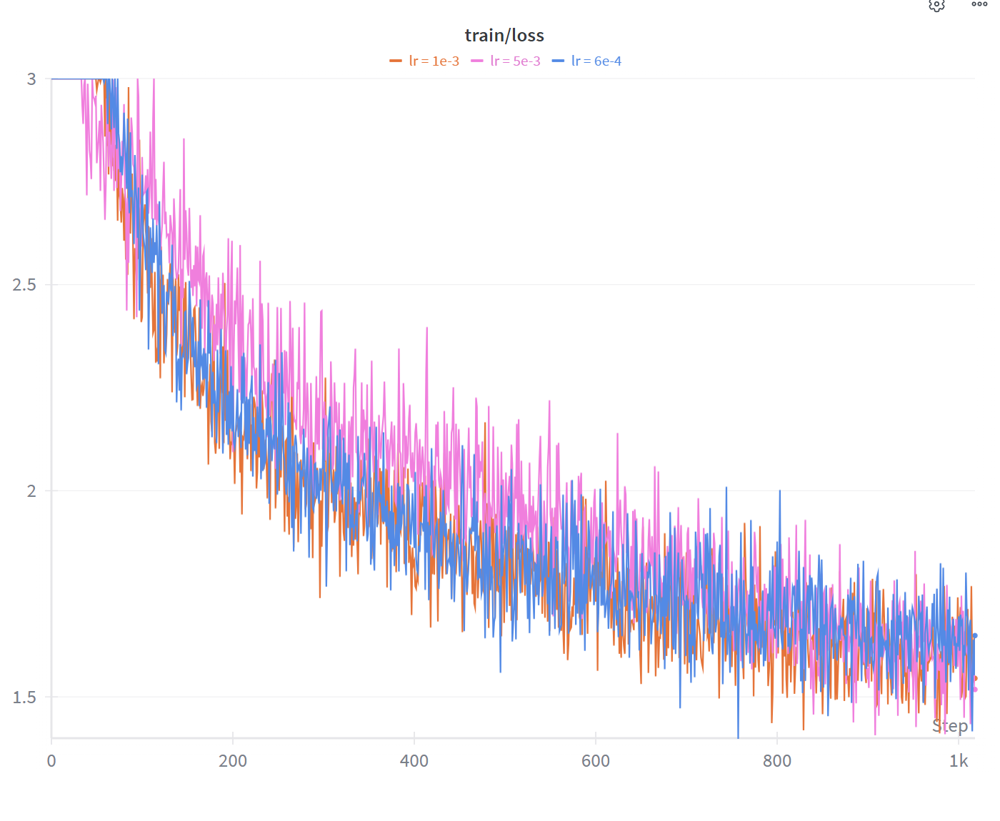
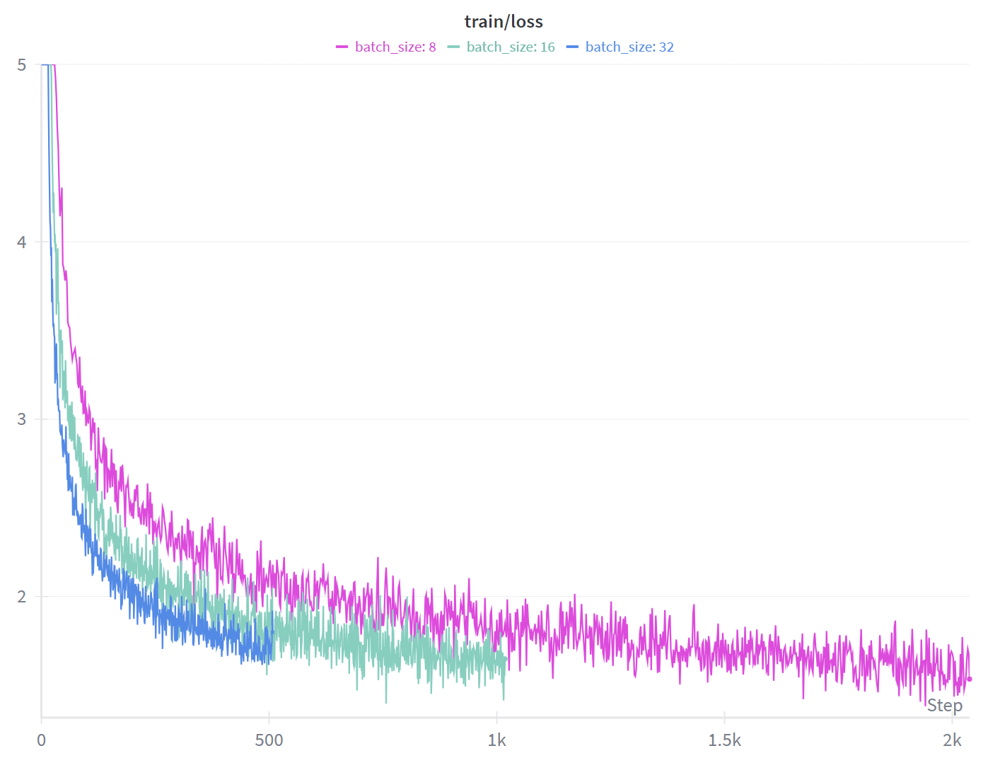
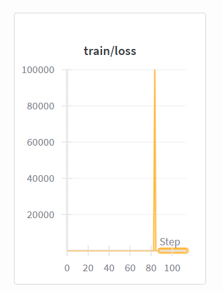
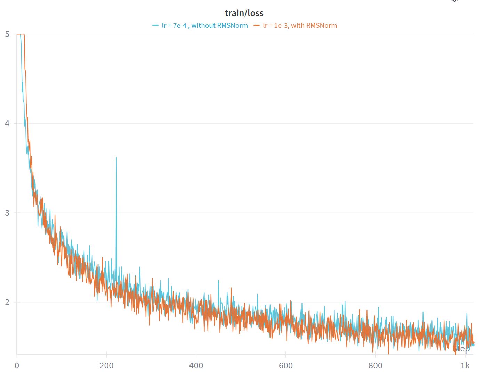
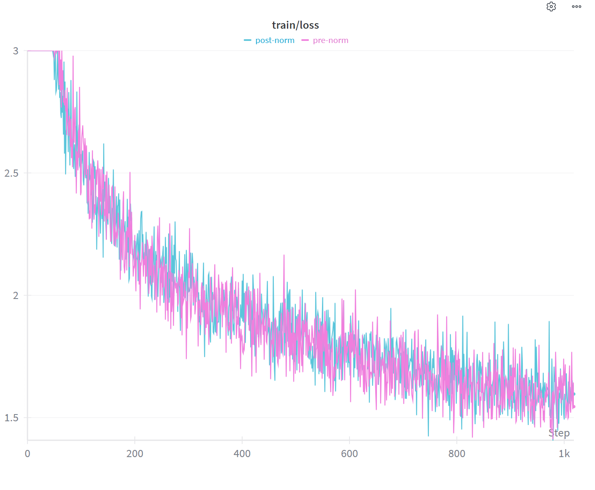
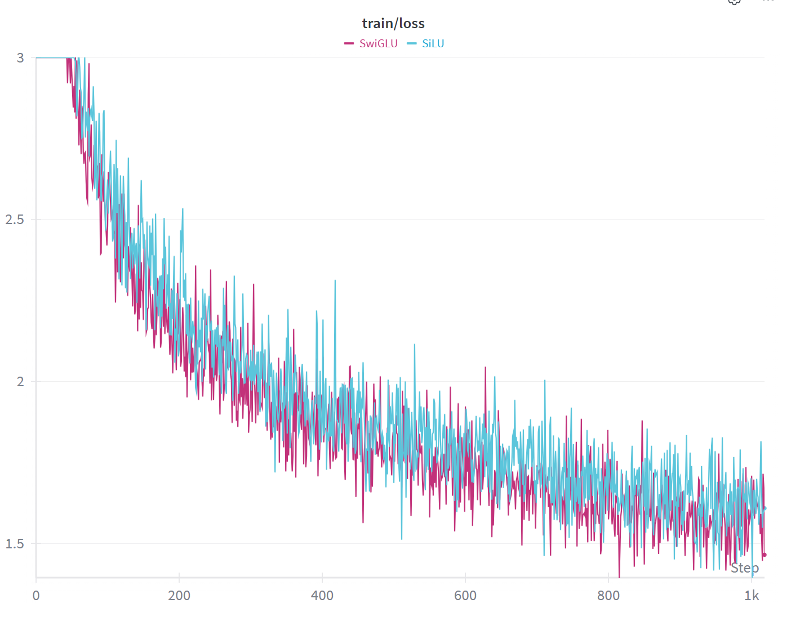
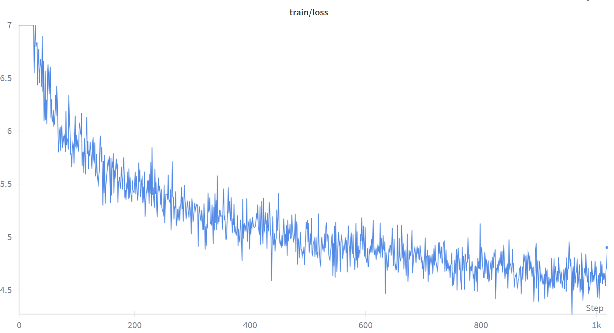

# 7 Experiments
在相关数据上训练一个小lm。
## 7.1 实验方法

理解 Transformer 的最佳方法是亲自修改并运行它。动手实践的是必须的。

为此，能够**快速、一致地进行实验并记录**你的操作至关重要。为了实现快速实验，我们将在小规模模型（1700万参数）和简单数据集（TinyStories）上运行多次实验。为了保持一致性，你将以系统化的方式消融组件并改变超参数(消融实验）；为了记录结果，我们会要求你提交实验日志以及与每个实验相关的学习曲线。

为了能够提交损失曲线，**请确保定期评估验证集损失，并记录步数和墙上时钟时间（实际运行时间）**。你可能会发现诸如 Weights and Biases 之类的日志基础设施很有帮助。

### Problem（experiment_log）：实验日志（3分）

针对你的训练和评估代码，创建一个实验跟踪基础设施，允许你根据梯度步数和墙上时钟时间跟踪实验和损失曲线。

提交：实验的日志基础设施代码，以及针对本节后续作业题目的实验日志（一份记录你所有尝试内容的文档）。


## 7.2 TinyStories

我们将从一个非常简单的数据集（TinyStories; Eldan 和 Li, 2023）开始，模型在此数据集上训练速度很快，我们可以观察到一些有趣的行为。获取该数据集的说明位于第1节。

该数据集的一个示例如下。

**示例（tinystories_example）**：来自 TinyStories 的一个例子
Once upon a time there was a little boy named Ben. Ben loved to explore the world around him. He saw many amazing things, like beautiful vases that were on display in a store. One day, Ben was walking through the store when he came across a very special vase. When Ben saw it he was amazed! He said, “Wow, that is a really amazing vase! Can I buy it?” The shopkeeper smiled and said, “Of course you can. You can take it home and show all your friends how amazing it is!” So Ben took the vase home and he was so proud of it! He called his friends over and showed them the amazing vase. All his friends thought the vase was beautiful and couldn’t believe how lucky Ben was. And that’s how Ben found an amazing vase in the store!

超参数调优(Hyperparameter tuning)：我们将告知你一些最基础的超参数作为开始，并要求你为其他超参数找到运行良好的设置。

vocab_size 10000。典型的词表大小在几万到几十万之间。你应该改变这个数值，观察词表和模型行为的变化。

context_length 256。像 TinyStories 这样简单的数据集可能不需要很长的序列长度，但对于之后的 OpenWebText 数据，你可能需要改变它。尝试改变这个值，观察其对每次迭代运行时间和最终困惑度的影响。

$d_{model}$  512。这比许多小型 Transformer 论文中使用的 768 维略小，但这会提高运行速度。

$d_{ff}$ 1344。这大约是 d_model 的 8/3，同时是 64 的倍数，这有利于 GPU 性能。

RoPE theta 参数 Θ   10000。

层数和头数：4层，16个头。总计将提供约 1700 万个非嵌入参数，这是一个相当小的 Transformer。

处理的总 token 数 327,680,000（你的 batch size × 总步数 × 上下文长度应大致等于此值）。

你应该通过反复试验为以下其他超参数找到良好的默认值：学习率、学习率预热（warmup）、其他 AdamW 超参数（β1, β2, ϵ）以及权重衰减（weight decay）。你可以在 Kingma 和 Ba [2015] 中找到此类超参数的典型选择。

**Putting it together**：现在你可以通过获取训练好的 BPE 分词器、对训练数据集进行分词，并在你编写的训练循环中运行，将一切整合在一起。重要提示：如果你的实现正确且高效，上述超参数在 1 张 H100 GPU 上应产生大约 30-40 分钟的运行时间。如果你的运行时间长得多，请检查并确保你的数据加载、检查点保存或验证损失计算代码没有成为性能瓶颈，并且你的实现已正确进行了批处理（batched）。

**模型架构调试的技巧和窍门**：我们强烈建议你习惯使用 IDE 内置的调试器（例如 VSCode/PyCharm），这比使用 print 语句调试更节省时间。如果你使用文本编辑器，可以使用类似 pdb 的工具。调试模型架构时，其他一些良好的实践包括：

1. 开发任何神经网络架构时，常见的首步是对单个微批次（minibatch）进行过拟合。如果你的实现正确，你应该能够迅速将训练损失降至接近零。
2. 在模型各个组件中设置调试断点，检查中间张量的形状，确保它们符合你的预期。
3. 监控激活值、模型权重和梯度的范数，确保它们没有爆炸或消失。


### Problem（learning_rate）：调优学习率（3分）（4个 H100 小时）

学习率是要调优的最重要的超参数之一。利用你训练的基础模型，回答以下问题：

(a) 对学习率进行超参数搜索，并报告最终损失（如果优化器发散，请注明）。

提交：1 与多个学习率相关的学习曲线。解释你的超参数搜索策略。2 在 TinyStories 上（每个 token）验证损失至多为 1.45 的模型。

**低资源/缩减规模提示**：在 CPU 或 Apple Silicon 上进行少量步数训练

如果你在 CPU 或 mps 上运行，你应该将处理的总 token 数减少到 40,000,000，这足以产生合理的流畅文本。你也可以将目标验证损失从 1.45 提高到 2.00。

在我们使用 M3 Max 芯片和 36 GB 内存运行调优学习率后的参考代码时，我们使用 batch size × 总步数 × 上下文长度 = 32 × 5000 × 256 = 40,960,000 token，这在 cpu 上耗时 1 小时 22 分钟，在 mps 上耗时 36 分钟。在第 5000 步时，我们达到了 1.80 的验证损失。

一些额外提示：

1. 当使用 X 个训练步数时，我们建议调整余弦学习率衰减计划，使其在恰好第 X 步时终止衰减（即达到最小学习率）。
2. 使用 mps 时，不要使用 TF32 内核，即不要像使用 cuda 设备那样设置 torch.set_float32_matmul_precision('high')。我们尝试在 mps（torch 版本 2.6.0）上启用 TF32 内核，发现后端会使用静默损坏的内核，导致训练不稳定。
3. 你可以通过使用 torch.compile 对模型进行 JIT 编译来加速训练。具体而言：在 cpu 上，使用 model = torch.compile(model) 编译你的模型。在 mps 上，你可以使用 model = torch.compile(model, backend="aot_eager") 在一定程度上优化反向传播。截至 torch 版本 2.6.0，mps 上不支持使用 Inductor 进行编译。

(b) 民间经验认为，最佳学习率处于“稳定边缘”。调查学习率发散的点与你的最佳学习率之间的关系。

提交：增加学习率的学习曲线，其中至少包括一次发散运行，并分析这与收敛率的关系。

#### Answer：
（a) vocab = 50237
```powershell
>>     --batch_size 32 `
>>     --context_length 256 `
>>     --d_model 512 `
>>     --num_layers 4 `
>>     --num_heads 16 `
>>     --d_ff 1344 `
>>     --max_iters 5000 `
>>     --warmup_iters 500 `
>>     --lr // `
>>     --device "cuda"
```
在40b token上运行。



现在让我们改变 batch size，看看训练会发生什么。Batch size 极其重要——它们让我们通过进行更大规模的矩阵乘法从 GPU 中获得更高的效率，但我们是否总是希望 batch size 越大越好？让我们通过实验来找出答案。

### Problem（batch_size_experiment）：Batch size 变化（1分）（2个 H100 小时）

将你的 batch size 从 1 一直改变到 GPU 显存限制。尝试一些中间的 batch size，包括典型的 64 和 128。

提交：1 不同 batch size 运行的学习曲线。如有必要，应再次优化学习率。  2 几句话讨论你关于 batch size 及其对训练影响的发现。

#### Answer: 



有了解码器，我们现在可以生成文本了！我们将从模型中生成文本并观察其效果。作为参考，你应该获得至少与下方示例一样好的输出。

**示例（ts_generate_example）**：来自 TinyStories 语言模型的样本输出
Once upon a time, there was a pretty girl named Lily. She loved to eat gum, especially the big black one. One day, Lily’s mom asked her to help cook dinner. Lily was so excited! She loved to help her mom. Lily’s mom made a big pot of soup for dinner. Lily was so happy and said, “Thank you, Mommy! I love you.” She helped her mom pour the soup into a big bowl. After dinner, Lily’s mom made some yummy soup. Lily loved it! She said, “Thank you, Mommy! This soup is so yummy!” Her mom smiled and said, “I’m glad you like it, Lily.” They finished cooking and continued to cook together. The end.


**低资源/缩减规模提示**：在 CPU 或 Apple Silicon 上生成文本

如果你使用了处理 40M token 的低资源配置，你应该看到生成的文本仍然类似于英语，但不如上面那样流畅。例如，我们的 TinyStories 语言模型在 40M token 上训练的样本输出如下：

Once upon a time, there was a little girl named Sue. Sue had a tooth that she loved very much. It was his best head. One day, Sue went for a walk and met a ladybug! They became good friends and played on the path together. “Hey, Polly! Let’s go out!” said Tim. Sue looked at the sky and saw that it was difficult to find a way to dance shining. She smiled and agreed to help the talking!” As Sue watched the sky moved, what it was. She


以下是准确的题目说明和要求：
### Problem（generate）：生成文本（1分）

使用你的解码器和训练好的检查点，报告模型生成的文本。你可能需要调整解码器参数（温度、top-p 等）以获得流畅的输出。

提交：至少 256 个 token 的文本转储（或直到遇到第一个 <|endoftext|> token），并对该输出的流畅度以及影响该输出质量好坏的至少两个因素进行简要评论。

#### Answer：
val_loss = 1.55 的模型，temp = 0.3, top_p = 0.9，参考生成：
```powershell
[Prompt]: 
Once upon a time, there was a little girl named Sue.

[Generated]:
Once upon a time, there was a little girl named Sue. Sue was very adventurous. She loved to play outside and explore the world. One day, she found a big box in her backyard. She was very excited and wanted to see what was inside.
Sue opened the box and found a big, red ball. She was so happy and started to play with it. She threw the ball, and it went very high. Sue was having so much fun. But then, she saw a big, scary dog. The dog was barking and running towards her.
The big dog was very loud and scary. It ran away very fast. Sue was scared and ran back to her house. She told her mom about the scary dog. Her mom hugged her and said, "It's okay, Sue. We can find a way to make it better." They went back to the backyard and found a safe place to hide. Sue was happy and not scared anymore.
```


## 7.3 消融实验与架构修改

理解 Transformer 的最佳方法是实际对其进行修改并观察其表现。我们现在将进行一些简单的消融和修改。

**消融 1：层归一化**：通常认为层归一化对 Transformer 训练的稳定性至关重要。但也许我们想冒险尝试一下。让我们从每个 Transformer 模块中移除 RMSNorm，看看会发生什么。

### Problem (layer_norm_ablation): 移除 RMSNorm 并训练 (1 point) (1 H100 hr)

从你的 Transformer 中移除所有的 RMSNorm 并进行训练。在之前的最优学习率下会发生什么？你能通过使用较低的学习率来获得稳定性吗？

提交：移除 RMSNorm 并训练时的学习曲线，以及最佳学习率下的训练曲线。

提交：关于 RMSNorm 影响的几句话评论。

#### Answer：
lr = 1e-3, without RMSNorm:   第870/10000step时即发散到nan。


lr = 1e-3, with RMSNorm  &  lr = 7e-4 , without RMSNorm: 


现在让我们研究另一个乍看之下似乎很随意的层归一化选择。Pre-norm Transformer 模块定义为

$$z = x + MultiHeadedSelfAttention(RMSNorm(x))$$

$$y = z + FFN(RMSNorm(z))$$

这是对原始 Transformer 架构为数不多的“共识”修改之一，原始架构使用的是 post-norm 方法，即

$$z = RMSNorm(x + MultiHeadedSelfAttention(x))$$

$$y = RMSNorm(z + FFN(z))$$

让我们改回 post-norm 方法，看看会发生什么。

### Problem (pre_norm_ablation): 实现 post-norm 并训练 (1 point) (1 H100 hr)

将你的 pre-norm Transformer 实现修改为 post-norm 实现。使用 post-norm 模型进行训练并观察结果。

提交：post-norm Transformer 的训练曲线，并与 pre-norm 的曲线进行对比。

我们看到层归一化对 Transformer 的行为有重大影响，甚至层归一化的位置也很重要。


#### Answer：

loss 1.60左右，收敛略慢一点


**消融 2**：位置嵌入 我们接下来将研究位置嵌入对模型性能的影响。具体来说，我们将对比基础模型（使用 RoPE）与完全不包含位置嵌入（NoPE）的情况。事实证明，仅解码器（decoder-only）的 Transformer，即像我们实现的那样带有因果掩码的模型，在理论上可以在不显式提供位置嵌入的情况下推断出相对或绝对位置信息 [Tsai et al., 2019, Kazemnejad et al., 2023]。我们现在将通过实验测试 NoPE 与 RoPE 相比表现如何。
### Problem (no_pos_emb): 实现 NoPE (1 point) (1 H100 hr)

修改带有 RoPE 的 Transformer 实现，完全移除位置嵌入信息，看看会发生什么。

#### Answer：

nope的loss波动更大一点，收敛也更慢


**消融 3**：SwiGLU vs. SiLU 接下来，我们将效仿 Shazeer [2020]，通过对比 SwiGLU 前馈网络与使用 SiLU 激活函数但没有门控线性单元（GLU）的前馈网络的性能，来测试前馈网络中门控的重要性：

$$FFNSiLU(x) = W2SiLU(W1x)$$

(25)

回想一下，在我们的 SwiGLU 实现中，我们将内部前馈层的维度设置为大约

$$dff = \frac{8}{3}dmodel$$

（同时确保

$$dff\mod 64 = 0$$

，以利用 GPU 张量核心）。在你的 FFNSiLU 实现中，你应该设置

$$dff = 4 \times dmodel$$

，以近似匹配 SwiGLU 前馈网络的参数量（后者有三个而不是两个权重矩阵）。

### Problem (swiglu_ablation): SwiGLU vs. SiLU (1 point) (1 H100 hr)

提交：在参数量近似匹配的情况下，对比 SwiGLU 和 SiLU 前馈网络性能的训练曲线。

#### Answer：



低资源/缩减规模提示：GPU 资源有限的在线学生应在 TinyStories 上测试修改。 在作业的剩余部分，我们将转向更大规模、噪声更多的网络数据集 (OpenWebText)，尝试架构修改并（可选）向课程排行榜提交结果。 在 OpenWebText 上训练一个流利的语言模型需要很长时间，因此我们建议 GPU 受限的在线学生继续在 TinyStories 上测试修改（使用验证集损失作为评估性能的指标）。

## 7.4 在 OpenWebText 上运行

我们现在将转向一个更标准的、从网络创建的预训练数据集。OpenWebText [Gokaslan et al., 2019] 的一个小样本也作为一个单独的文本文件提供：参见第 1 节了解如何获取该文件。 这是一个来自 OpenWebText 的示例。请注意文本是如何更加真实、复杂且多样化的。你可能想浏览一下训练数据集，以了解网络爬取语料库的训练数据是什么样的。

### Example (owt_example): 一个来自 OWT 的例子

Baseball Prospectus director of technology Harry Pavlidis took a risk when he hired Jonathan Judge. Pavlidis knew that, as Alan Schwarz wrote in The Numbers Game, “no corner of American culture is more precisely counted, more passionately quantified, than performances of baseball players.” With a few clicks here and there, you can findout that Noah Syndergaard’s fastball revolves more than 2,100 times per minute on its way to the plate, that Nelson Cruz had the game’s highest average exit velocity among qualified hitters in 2016 and myriad other tidbits that seem ripped from a video game or science fiction novel. The rising ocean of data has empowered an increasingly important actor in baseball’s culture: the analytical hobbyist. That empowerment comes with added scrutiny – on the measurements, but also on the people and publications behind them. With Baseball Prospectus, Pavlidis knew all about the backlash that accompanies quantitative imperfection. He also knew the site’s catching metrics needed to be reworked, and that it would take a learned mind – someone who could tackle complex statistical modeling problems – to complete the job. “He freaks us out.” Harry Pavlidis Pavlidis had a hunch that Judge “got it” based on the latter’s writing and their interaction at a sitesponsored ballpark event. Soon thereafter, the two talked over drinks. Pavlidis’ intuition was validated. Judge was a fit for the position – better yet, he was a willing fit. “I spoke to a lot of people,” Pavlidis said, “he was the only one brave enough to take it on.” [...]

注意：你可能需要为此实验重新调整超参数，例如学习率或批量大小。
### Problem (main_experiment): 在 OWT 上进行实验 (2 points) (3 H100 hrs)

在 OpenWebText 上训练你的语言模型，使用与 TinyStories 相同的模型架构和总训练迭代次数。该模型表现如何？ 
提交：你的语言模型在 OpenWebText 上的训练曲线。描述与 TinyStories 相比损失值的差异——我们应该如何解释这些损失？ 
提交：由 OpenWebText 语言模型生成的文本，格式与 TinyStories 的输出相同。这段文本的流畅度如何？为什么即使我们拥有与 TinyStories 相同的模型和计算预算，输出质量却更差？

#### Answer: 


generation: 
```powershell

[Prompt]: Once upon a time, there was a little girl named Sue.

[Generated]:
Once upon a time, there was a little girl named Sue.

First of all, all the time, this time the two men went down on the court.

Sticking on the waiting list is then, after all, the criminal justice is issued.

A month later, a woman said he had been freed from being used as a result of the male victim’s birth.

Bold, who was a woman in a boy’s mind, said, “She wanted to be her, and that she would have a baby.”

He was married in a drug-store store in the West Bank, which will have to be selling the drugs.

“I was totally surprised,” said Marc Berll. “I thought I was playing at a high school that was really our duty. But I was going to be very safe, and that was my first choice.”

The following year, a wife of her children raised her last name.

A woman was divorced from the right to left, a younger sister from the court, and her daughter, told the court that her son was pregnant.

The mother was a child and her baby had taken to death.

The man was born on the birthdays as a child and eventually a child came to school,
```
## 7.5 你自己的修改 + 排行榜

祝贺你完成到这一步。你快要完成了！你现在将尝试改进 Transformer 架构，并看看你的超参数和架构与班上其他学生相比如何。 排行榜规则 除了以下限制外没有其他限制： 运行时间 你的提交在 H100 上运行时间最多为 1.5 小时。你可以通过在 slurm 提交脚本中设置 `--time=01:30:00` 来强制执行此操作。 数据 你只能使用我们提供的 OpenWebText 训练数据集。 除此之外，你可以随意做任何你想做的事情。 如果你正在寻找一些关于实现什么的灵感，可以查看以下资源：

- 最先进的开源 LLM 家族，例如 Llama 3 [Grattafiori et al., 2024] 或 Qwen 2.5 [Yang et al., 2024]。

- NanoGPT speedrun 仓库 ([https://github.com/KellerJordan/modded-nanogpt](https://github.com/KellerJordan/modded-nanogpt))，社区成员在那里发布了许多有趣的修改，用于小规模语言模型预训练的“竞速”。例如，一个可以追溯到原始 Transformer 论文的常见修改是将输入和输出嵌入的权重绑定在一起（参见 Vaswani et al. [2017] (Section 3.4) 和 Chowdhery et al. [2022] (Section 2)）。如果你尝试权重绑定，你可能需要减小嵌入/LM head 初始化的标准差。 在尝试完整的 1.5 小时运行之前，你会希望在 OpenWebText 的一个小子集或 TinyStories 上测试这些修改。 需要说明的是，我们注意到你在这个排行榜中发现的一些效果良好的修改可能无法泛化到更大规模的预训练。我们将在课程的缩放定律（scaling laws）单元进一步探讨这个想法。
    

### Problem (leaderboard): 排行榜 (6 points) (10 H100 hrs)

你将在上述排行榜规则下训练一个模型，目标是在 1.5 H100 小时内最小化语言模型的验证损失。 交付物：记录的最终验证损失、相关的训练曲线（清晰显示 x 轴为小于 1.5 小时的墙钟时间）以及你所做操作的描述。我们期望排行榜的提交至少能击败 5.0 损失这一朴素基准。在此处提交至排行榜：[https://github.com/stanford-cs336/assignment1-basics-leaderboard](https://github.com/stanford-cs336/assignment1-basics-leaderboard)