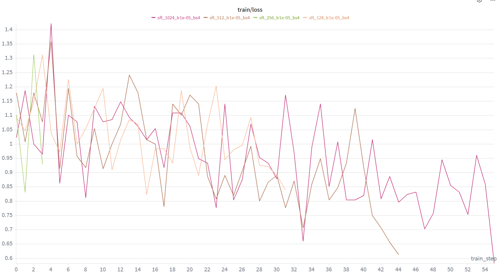

# 4 MATH上的Supervised Finetuning
```plaintext
Algorithm 1: Supervised Finetuning (SFT)
----------------------------------------
Input: initial policy model pi_theta_init; SFT dataset D

1. policy model pi_theta = pi_theta_init
2. for step = 1 to n_sft_steps:
3.    Sample a batch (Db) from D
4.    Compute cross-entropy loss using pi_theta
5.    Update parameters theta via gradient step
6. end for

Output: pi_theta
```

**面向推理的Supervised Finetuning。** 本节我们将按照上述的算法1， 基于MATH进行SFT。此处，我们以提高模型的推理能力为目标，而不是以直接预测正确的答案为目标。我们将finetune它，使得他先产生思维链（CoT）推理trace，然后再产生答案。为此，我们使用来自DeepSeek R1(DeepSeek-AI et al. [2025])的推理迹数据集，放置在/data/a5-alignment/MATH/sft.jsonl。  

实践上，训练一个推理模型时，SFT一般作为第二步RL finetuning的一个warm-up。这主要有两个原因：第一， SFT要求高质量的带注释的数据（即预先给出的推理trace），而RL只要求正确答案作为反馈。第二，即使在那些我们有很多带注释的数据的背景下，RL仍然可以通过找出比SFT数据更好的策略，来获得更多表现提升。不幸的是，我们现在使用的模型还是太小了，无法显示出SFT和RL协同效应带来的效果。所以在这一作业中我们分开处理应用这两者。

## 4.1 使用HuggingFace Models  

**加载一个HuggingFace model和tokenzier。** 为finetuning，使用HuggingFace而非vllm。使用如下starter code来加载：
```python 
from transformers import AutoModelForCausalLM, AutoTokenizer 
model = AutoModelForCausalLM.from_pretrained( 
	"/data/a5-alignment/models/Qwen2.5-Math-1.5B", 
	torch_dtype=torch.bfloat16, 
	attn_implementation="flash_attention_2", 
) 
tokenizer = AutoTokenizer.from_pretrained("/data/a5-alignment/models/Qwen2.5-Math-1.5B")
```

**前向传播。** 在加载模型之后，我们在一批ID输入上运行一次前向传播来获得logits（在.logits属性中），然后基于logits和实际上的label就可以计算loss了。  

```python
input_ids = train_batch["input_ids"].to(device)
labels = train_batch["labels"].to(device)
logits = model(input_ids).logits
loss = F.cross_entropy(..., ...)
```

**保存训练好的模型。**  
通过
```python
model.save_pretrained(save_directory=output_dir) tokenizer.save_pretrained(save_directory=output_dir)
```
来保存模型。

**梯度累积。** 我们可以不用每个batch都更新一次权重，可以每个batch都只算梯度，然后隔几步再把梯度加起来，一起更新权重：  
```python
gradient_accumulation_steps = 4
for idx, (inputs, labels) in enumerate(data_loader):

    loss = loss_fn(logits, labels) / gradient_accumulation_steps

    loss.backward()
    
    if (idx + 1) % gradient_accumulation_steps == 0:
        
        optimizer.step()
    
        optimizer.zero_grad()
```
这样一来，训练时的有效批大小就变成了原来的 $k$ 倍（即梯度累积的步数）。  


## 4.2 SFT辅助方法  
实施一些有助于SFT和后续的RL实验的方法。术语说明：后续张姐中，output, conpletion, response几个词是同一个概念。  

### 分词化prompts和outputs
对每个question-output对（q,o ) ，我们分别分词化question和output并且连接他们。然后用SFT model（后面的章节用RL策略）计算output的对数概率分布。  
我们还要构建response_mask：一个布尔掩码，它在response对应的tokens位置是true，在question和padding tokens的位置是false。使用这个掩码，我们才能只计算response tokens中对应的loss。  

#### Problem (tokenize_prompt_and_output): Prompt and output tokenization (2 points)

提交：实现一个tokenize_prompt_and_output方法，它如上所述地分别分词question, output，把他们拼一起， 然后构建response_mask。建议使用如下接口：  

```python
def tokenize_prompt_and_output(prompt_strs, output_strs, tokenizer): 
```
**参数 (Args):**

`prompt_strs`: `list[str]`，提示词字符串列表。
`output_strs`: `list[str]`，输出字符串列表。
`tokenizer`: `PreTrainedTokenizer`，用于分词的 Tokenizer。

**返回值 (Returns):**
 `dict[str, torch.Tensor]`。令 `prompt_and_output_lens` 为一个包含分词后的提示词和输出字符串长度的列表。返回的字典应包含以下键值：
 `input_ids`：  `torch.Tensor`，形状为 `(batch_size, max(prompt_and_output_lens) - 1)`：拼接分词后的提示词和输出字符串，并切掉最后一个 token。

`labels` ：  `torch.Tensor`，形状为 `(batch_size, max(prompt_and_output_lens) - 1)`：input_ids 移位后的输入 id，即去掉第一个 token 后的输入 id。

`response_mask`：  `torch.Tensor`，形状为 `(batch_size, max(prompt_and_output_lens) - 1)`：标签中针对回答 token 的掩码。

先适配`adapters.run_tokenize_prompt_and_output`，然后运行uv run pytest -k test_tokenize_prompt_and_output并通过。

#### Answer: 
见tokenize_prompt.py

### 计算per-token entropies

我们通过计算per-token entropies来衡量模型分布是否正在变得自信/变得过自信。例如，分布为[0.5, 0.5]可计算得熵 ≈ 0.7，而分布为[0.99, 0.01]则有H ≈ 0
分布p(x)的熵定义为：$$H(p) = -\sum_{x \in \mathcal{X}} p(x) \log p(x)$$p.s.需要注意这可以化简成更稳定的计算方式。把p(x) = softmax(x)带入上式，可得：$$H = \log \sum e^{z_j} - \sum p_i z_i$$
接下来实现这个函数。

#### Problem(compute_entropy): Per-token entropy (1 point) 

建议使用如下接口：
```python
def compute_entropy(logits: torch.Tensor) ->torch.Tensor:
    """
    Args:logits: torch.Tensor Tensor of shape (batch_size, sequence_length, vocab_size)containing unnormalized logits.
    Returns:torch.Tensor Shape (batch_size, sequence_length). The entropy for each next-token prediction.
    """
```
注意：你应当使用一些数值稳定性技巧(e.g. 使用logsumexp)来防止溢出。

适配adapters.run_compute_entropy，然后运行`uv run pytest -k test_compute_entropy`并通过。

##### Answer：
见pre_token_entropy.py

### 从模型加载对数概率
在SFT和RL中，首先都要加载对数概率。  
对一个前缀x，一个LM产出对下一个token的logits（$f_\theta(x) \in \mathbb{R}^{|V|}$），再给定$y \in V$，$y$ 的对数概率定义为：
$$\log p_\theta(y | x) = \log [\text{softmax}(f_\theta(x))]_y$$
其中符号 $[x]_y$ 表示取向量 $x$ 的第 $y$ 个元素。
p.s. 其实就是对上文的p_i取对数。

#### Problem(get_response_log_probs): 返回log-probs(and entropy)  (2points)
提交一个get_response_log_probs函数，返回上述的对数概率；可选地，也可以返回下一token的分布的熵。
建议使用如下接口：
```python
def get_response_log_probs(
    model: PreTrainedModel,
    input_ids: torch.Tensor,
    labels: torch.Tensor,
    return_token_entropy: bool = False,
) -> dict[str, torch.Tensor]:
    """
    Args:
    model: PreTrainedModel HuggingFace model used for scoring (placed on the correct device and in inference mode if gradients should not be computed).
    input_ids: torch.Tensor shape (batch_size, sequence_length), concatenated prompt + response tokens as produced by your tokenization method.
    labels: torch.Tensor shape (batch_size, sequence_length), labels as produced by yourtokenization method.
    return_token_entropy: bool If True, also return per-token entropy by callingcompute_entropy.
    
    Returns:
    dict[str, torch.Tensor].
        "log_probs" shape (batch_size, sequence_length), conditional log-probabilities log pθ(xt | x<t).
        "token_entropy" optional, shape (batch_size, sequence_length), per-token entropy for each position (present only if return_token_entropy=True).
    """
```
提示：model(input_ids).logits 来获取logits。
运行uv run pytest -k test_get_response_log_probs来测试。
##### Answer: 
见per_token_entropy.py和adapter.run_get_response_log_probs。注意如果bf16和flashattn2可能导致精度不足，可以不按课程要求初始化model。


### Masked_normalize
#### Problem (masked_normalize): Masked normalize (1 point)

实现masked_normalize。求loss并平均化（除以有效token数），接口如下：
```python
def masked_normalize( 
	tensor: torch.Tensor,
	mask: torch.Tensor, 
	normalize_constant: float, 
	dim: int | None = None, 
) -> torch.Tensor: 

Sum over a dimension and normalize by a constant, considering only those elements where mask == 1. 

Args: 
tensor: torch.Tensor The tensor to sum and normalize. 
mask: torch.Tensor Same shape as tensor; positions with 1 are included in the sum. 
normalize_constant: float the constant to divide by for normalization. 
dim: int | None the dimension to sum along before normalization.
If None, sum over all dimensions. 

Returns: torch.Tensor the normalized sum, where masked elements (mask == 0) don’t contribute to the sum.
```
适配adapters.run_masked_normalize， 运行uv run pytest -k test_masked_normalize。


##### Answer：
见masked_normalize.py


### SFT微批次训练：
进行一次microbatch训练。如果gradient_accumulation_steps > 1 ，就进行梯度累计。

#### Problem (sft_microbatch_train_step): Microbatch train step (3 points)

更新一次SFT，内容包括：交叉熵损失，和mask相加，梯度累计。接口如下：

```python
def sft_microbatch_train_step( 
	policy_log_probs: torch.Tensor, 
	response_mask: torch.Tensor, 
	gradient_accumulation_steps: int, 
	normalize_constant: float = 1.0, 
) -> tuple[torch.Tensor, dict[str, torch.Tensor]]: 

Execute a forward-and-backward pass on a microbatch. 

Args: 

policy_log_probs (batch_size, sequence_length), per-token log-probabilities from the SFT policy being trained. 

response_mask (batch_size, sequence_length), 1 for response tokens, 0 for prompt/padding. 

gradient_accumulation_steps Number of microbatches per optimizer step. 

normalize_constant The constant by which to divide the sum. It is fine to leave this as 1.0. 

Returns: 

tuple[torch.Tensor, dict[str, torch.Tensor]]. 

loss scalar tensor. The microbatch loss, adjusted for gradient accumulation. We return this so we can log it. 

metadata Dict with metadata from the underlying loss call, and any other statistics you might want to log.
```

适配adapters.run_sft_microbatch_train_step， 运行uv run pytest -k test_sft_microbatch_train_step。

##### Answer：
见sft_microbatch_train_step.py

#### Problem (log_generations): Logging generations (1 point)

函数至少应该log：
1. The input prompt. 
2. The response generated by the SFT/RL model. 
3. The ground-truth answer. 
4. The reward information, including format, answer, and total reward. 
5. The average token entropy of the response. 
6. The average response length, average response length for correct responses, and average response length for incorrect responses.

##### Answer：
见log_generations.py


## 4.3 SFT 实验

利用上述各部分组件，你现在将实现完整的 SFT 流程（算法 1），在 MATH 数据集上对 Qwen 2.5 Math 1.5B 基础模型进行微调。`/data/a5-alignment/MATH/sft.jsonl` 中的每个示例都包含一个格式化的提示（prompt）和目标响应（target response），其中目标响应包含思维链（chain-of-thought）推理轨迹和最终答案。具体而言，每个示例都是类型为 `{"prompt": str, "response": str}` 的 JSON 元素。

为了跟踪模型在训练过程中的进展，你应该定期在 MATH 验证集上对其进行评估。你应该使用 2 个 GPU 运行脚本，一个 GPU 用于策略模型（policy model），另一个用于 vLLM 实例以评估该策略。为实现此功能，以下是初始化 vLLM 并确保在每次滚动（rollout）阶段之前将策略权重加载到 vLLM 实例中的起始代码：

```python
from vllm.model_executor import set_random_seed as vllm_set_random_seed

def init_vllm(model_id: str, device: str, seed: int, gpu_memory_utilization: float = 0.85):
    """
    启动推理进程，此处使用 vLLM 将模型保持在与策略模型不同的 GPU 上。
    """
    vllm_set_random_seed(seed)
    
    # 来自 TRL 的 Monkeypatch:
    # https://github.com/huggingface/trl/blob/
    # 22759c820867c8659d00082ba8cf004e963873c1/trl/trainer/grpo_trainer.py
    # 对 vLLM 进行补丁，以确保我们能够：
    # (1) 将 vLLM 模型放置在所需的设备上 (world_size_patch)
    # (2) 避免运行不适用于我们设置的测试 (profiling_patch)
    world_size_patch = patch("torch.distributed.get_world_size", return_value=1)
    profiling_patch = patch(
        "vllm.worker.worker.Worker._assert_memory_footprint_increased_during_profiling",
        return_value=None
    )
    
    with world_size_patch, profiling_patch:
        return LLM(
            model=model_id,
            device=device,
            dtype=torch.bfloat16,
            enable_prefix_caching=True,
            gpu_memory_utilization=gpu_memory_utilization,
        )

def load_policy_into_vllm_instance(policy: PreTrainedModel, llm: LLM):
    """
    复制自 https://github.com/huggingface/trl/blob/
    22759c820867c8659d00082ba8cf004e963873c1/trl/trainer/grpo_trainer.py#L670
    """
    state_dict = policy.state_dict()
    llm_model = llm.llm_engine.model_executor.driver_worker.model_runner.model
    llm_model.load_weights(state_dict.items())
```

你可能会发现记录训练和验证步骤的相关指标很有帮助（这在后续的 RL 实验中也很有用）。要在 wandb 中实现这一点，你可以使用以下代码：

```python
# 设置 wandb 指标
wandb.define_metric("train_step") # 训练的 x 轴
wandb.define_metric("eval_step") # 评估的 x 轴

# 所有以 train/ 开头的指标都与 train_step 绑定
wandb.define_metric("train/*", step_metric="train_step")
# 所有以 eval/ 开头的指标都与 eval_step 绑定
wandb.define_metric("eval/*", step_metric="eval_step")
```


最后，我们建议你使用梯度裁剪（gradient clipping），裁剪值为 1.0。


### Problem (sft_experiment): 在 MATH 数据集上运行 SFT (2 分) (2 个 H100 小时)

1. 使用 Qwen 2.5 Math 1.5B 基础模型，对推理 SFT 示例（提供在 `/data/a5-alignment/MATH/sft.jsonl` 中）运行 SFT，改变 SFT 的唯一示例数量，范围为 {128, 256, 512, 1024}，并包含使用完整数据集的情况。调整学习率和批大小，以在使用完整数据集时实现至少 15% 的验证准确率。
 
2. 过滤推理 SFT 示例，仅包含产生正确答案的示例。在（完整）过滤后的数据集上运行 SFT，并报告过滤后数据集的大小以及你达到的验证准确率。


#### Answer: 
见sft_experiment.py & run_sft_experiment.py

1：

可以看到1024左右就有点饱和了。